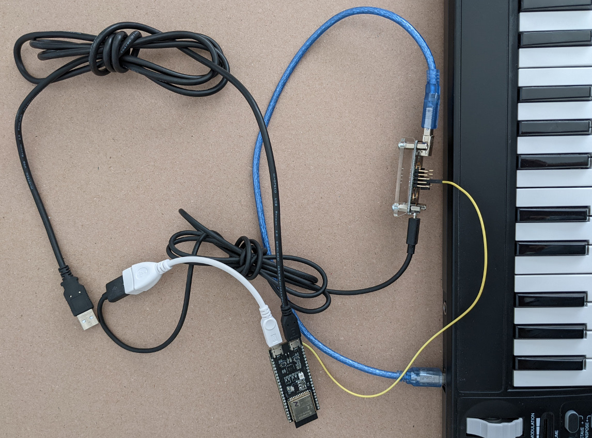
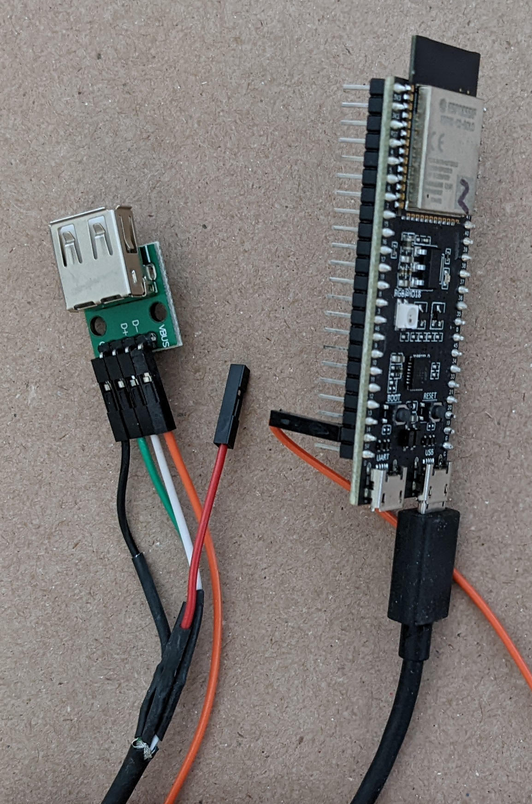

# ESP32 S2 USB Host Jumpstart

A collection of experiments and demos using Espressif ESP32 S2 in USB host
mode. Most of the sketches have little or no C++ or Arduino dependencies so can
be converted to ESP-IDF programs. The ESP32 S3 does not have Arduino support so
converting the sketches back to C ESP-IDF programs would be useful.

The code is based on ESP32 USB host tests and examples included with ESP-IDF. 

Use at your own risk. Error handling is lacking. These are demos so do not do
anything useful except show it is possible to communicate with real world USB
devices. More work is needed to make them useful.

To see the sketch output on the serial monitor set the Core Debug Level to
Verbose.

## Software

* Arduino IDE 1.8.16
* arduino-esp32 (stable) 2.0.1

## Hardware

* Espressif ESP-32-S2-DevKitC-1 board
* USB OTG to USB host cable
* USB break out board to access VBUS

The USB printer is self-powered which means it is powered by its battery. It
does not need the USB VBUS 5V and does not charge its battery from VBUS.

```
ESP32-S2-DevKitC-1 -> USB OTG to USB host -> USB cable -> USB Printer
```


The above configuration fails for bus-powered devices such as keyboards because
they depend on VBUS providing 5V. The DevKit USB port does not provide 5V on
VBUS. It only works as a power input, not output. A true USB OTG port is
able to switch the direction of VBUS based on the USB micro connector ID pin.

The following is my workaround for this. 

```
ESP32-S2-DevKitC-1 -> USB OTG to USB host -> USB breakout -> USB MIDI
        5V                                       VBUS  
        |                                         ^
        v                                         |
        .-----------------------------------------.
```



The yellow wire connects 5V out on the dev board to the USB breakout to power
the USB MIDI keyboard.

A more reliable solution is to make a cable using USB connector breakout
boards that looks like the USB OTG to USB host cable but with an extra flying
wire for VBUS.

The following cable was made by cutting a regular micro USB cable in half.
Using the side with the micro USB connector, separate the 4 wires. Solder
on Dupont wires also cut in half with matching colors. The other connector
is a USB Type A receptacle breakout board. The red VBUS wire is not connected
because the ESP32 S2 board does not provide 5V out on this pin. The long orange
wire connects 5V out from the ESP32 S2 DevKit board to VBUS.




An alternative is to cut open a USB OTG to USB host cable, cut the red power
wire then solder a flying wire to VBUS.

## dumpdesc -- USB Descriptor Dump

Arduino sketch that shows frequently used USB descriptors in human readable
form.

Sample output
```
[ 15501][I][show_desc.hpp:54] show_config_desc(): bLength: 9
[ 15506][I][show_desc.hpp:55] show_config_desc(): bDescriptorType(config): 2
[ 15513][I][show_desc.hpp:56] show_config_desc(): wTotalLength: 216
[ 15519][I][show_desc.hpp:57] show_config_desc(): bNumInterfaces: 4
[ 15525][I][show_desc.hpp:58] show_config_desc(): bConfigurationValue: 1
[ 15531][I][show_desc.hpp:59] show_config_desc(): iConfiguration: 0
[ 15537][I][show_desc.hpp:64] show_config_desc(): bmAttributes(, Remote Wakeup): 0xa0
[ 15545][I][show_desc.hpp:65] show_config_desc(): bMaxPower: 50 = 100 mA
```

## usbhmidi -- USB Host MIDI

Arduino sketch that is just enough to get a USB MIDI keyboard (and may other
MIDI devices) talking MIDI over USB. It might be possible to make this work
with the USB transport layer of the Forty Seven Effects MIDI Library. But I
not sure I will ever have time for this.

USB MIDI Event Packet Format (always 4 bytes).

|Byte 0 |Byte 1 |Byte 2 |Byte 3
|-------|-------|-------|------
|CN+CIN |MIDI_0 |MIDI_1 |MIDI_2

* CN = Cable Number (0x0..0xf) specifies virtual MIDI jack/cable
* CIN = Code Index Number (0x0..0xf) classifies the 3 MIDI bytes. See Table
  4-1 in the MIDI 1.0 spec at usb.org.

Sample output showing MIDI note on/off from a keyboard
```
[ 69235][I][usbhmidi.ino:30] midi_transfer_cb(): midi_transfer_cb context: 0
[ 69235][I][usbhmidi.ino:37] midi_transfer_cb(): midi: 08 80 3c 40
[ 74603][I][usbhmidi.ino:30] midi_transfer_cb(): midi_transfer_cb context: 1
[ 74604][I][usbhmidi.ino:37] midi_transfer_cb(): midi: 09 90 3c 7a
[ 74690][I][usbhmidi.ino:30] midi_transfer_cb(): midi_transfer_cb context: 2
[ 74690][I][usbhmidi.ino:37] midi_transfer_cb(): midi: 08 80 3c 40
```

## usbhhidboot -- USB Host HID Boot Keyboard

Arduino sketch that is just enough to get a USB HID keyboard working. It uses
HID boot mode which means it does not need to fetch or parse the HID report
descriptor. More work required to convert the HID reports into ASCII chars and
key up/down events. Does not implement SetProtocol so some keyboards may
require this.

Maybe model this on the official USB Host KeyboardController object.
https://www.arduino.cc/en/Reference/KeyboardControllerConstructor

Some explanation of USB HID reports.
https://wiki.osdev.org/USB_Human_Interface_Devices

Sample output with additional comments
```
// All keys up
[ 29449][I][usbhhidboot.ino:36] keyboard_transfer_cb(): data: 00 00 00 00 00 00 00 00
// Shift key down
[ 31770][I][usbhhidboot.ino:36] keyboard_transfer_cb(): data: 02 00 00 00 00 00 00 00
[ 32265][I][usbhhidboot.ino:36] keyboard_transfer_cb(): data: 02 00 00 00 00 00 00 00
// Shift and 'A' keys down
[ 33514][I][usbhhidboot.ino:36] keyboard_transfer_cb(): data: 02 00 04 00 00 00 00 00
[ 34026][I][usbhhidboot.ino:36] keyboard_transfer_cb(): data: 02 00 04 00 00 00 00 00
// All keys up
[ 34185][I][usbhhidboot.ino:36] keyboard_transfer_cb(): data: 00 00 00 00 00 00 00 00
```

## usbhprinter -- USB Host Printer Class

Arduino sketch that is just enough to print one line on a USB thermal receipt
printer. Would be nice to create a subclass from the Arduino stream class so
it appears similar to a Serial device. And an ESC POS library to print in
graphics mode, double wide, italics, bold, etc. Lots more work required.

~~The sketch currently prints 1 line with "Hello from ESP32 S2".~~

The sketch reads a line from the serial monitor and writes it to the printer.
This proves USB printer communication is working. This may be the first ESP32
typewriter.
